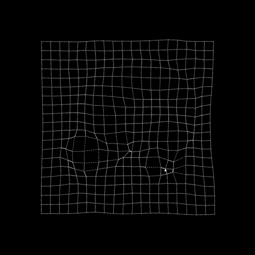

# Hi there 👋

## *Mar Bautista´s Profile.*

>**This is my first experience learning programming, and I have many ideas that I want to make a reality, but for now, I am trying to focus on learning.**
### 🌱 I’m currently learning web development languages such like:
- [x] HTML & CSS
- [ ] Java Script
- [ ] Ruby, Ruby & Rails
- [ ] React
#### *And also I am interested in data science and machine learning*

### 👯 I’m looking to collaborate:
- **Web development projects.**
- **Projects of data science for Bussines or economic topics.**

### 🤔 I’m looking for help with my first personal project, an online store. I just created the repository and a basic structure.

### 📫 You can reach me at:
- GitHub: [@marilirulita](https://github.com/marilirulita)
- LinkedIn: [@marilirulita](https://www.linkedin.com/in/mar-y-sol-bautista-5a6894151/)
- Twitter: [@marilirulita](https://twitter.com/marylirulita)
### ⚡ Fun fact:  
- **I am a fanatic of anime, and when I am codding I like to listen to music with anime or fantasy themes** *(at this moment I am listening to a mixture of Celtic and magical forest music)* 😄.
